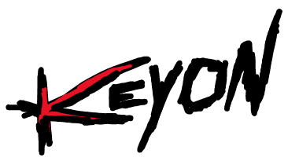

[](https://keyon.io/)


## Installation

This is a [Node.js](https://nodejs.org/en/) module available through the
[npm registry](https://www.npmjs.com/).

Before installing, [download and install Node.js](https://nodejs.org/en/download/).
Node.js 8 or higher is required.

Installation is done using the
[`npm install` command](https://docs.npmjs.com/getting-started/installing-npm-packages-locally):

```bash
$ npm install -g keyon
```
